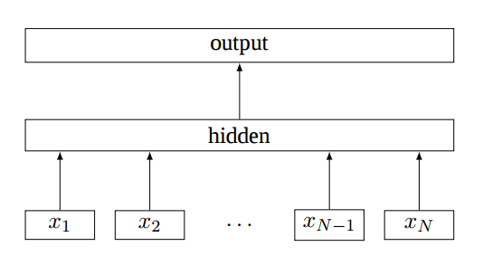
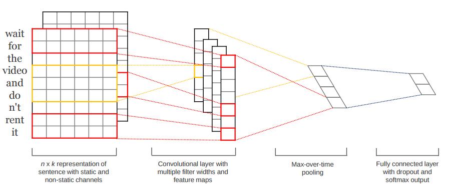
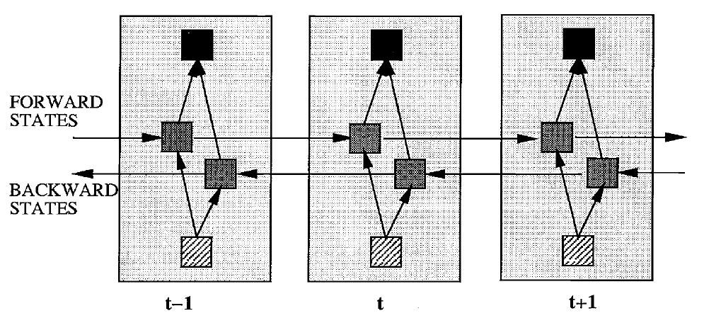
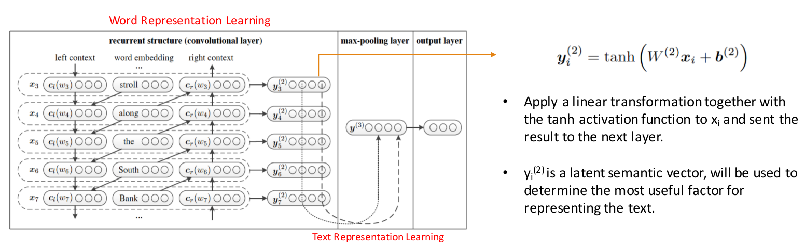

# text classification in tensorflow
Implementing multi models for Text Classification in TensorFlow.

## Contents
### Data and Preprocess
#### Data
Models are used to perform sentiment analysis on movie reviews from the [Large Movie Review Dataset](http://ai.stanford.edu/~amaas/data/sentiment/), which contains 25,000 highly polar movie reviews for training, and 25,000 for testing.<br/>
In this task, given a movie review, the model attempts to predict whether it is positive or negative. This is a binary classification task.

#### Preprocess
1. Load positive and negative sentences from the raw data files.
2. Clean the text data.
3. Pad each sentence to the maximum sentence length.
4. Word vector mapping, Each sentence becomes a bag of word vectors.

### Models
#### 1. FastText

- word representations: [Enriching Word Vectors with Subword Information](https://arxiv.org/abs/1607.04606)
- text classification: [Bag of Tricks for Efficient Text Classification](https://arxiv.org/abs/1607.01759)

#### 2. TextCNN


- [Convolutional Neural Networks for Sentence Classification](https://arxiv.org/abs/1408.5882)
- [A Sensitivity Analysis of (and Practitioners' Guide to) Convolutional Neural Networks for Sentence Classification](https://arxiv.org/abs/1510.03820)

#### 3. BiLSTM

- [Bidirectional Recurrent Neural Networks](http://ieeexplore.ieee.org/document/650093/)

#### 4. TextRCNN

Learn more contextual information   than conventional window-based neural networks.
- [Recurrent Convolutional Neural Networks for Text Classification](https://scholar.google.com.hk/scholar?q=Recurrent+Convolutional+Neural+Networks+for+Text+Classification&hl=zh-CN&as_sdt=0&as_vis=1&oi=scholart&sa=X&ved=0ahUKEwjpx82cvqTUAhWHspQKHUbDBDYQgQMIITAA)

## Performance
```
epochs = 10
batch_size = 64
max_learning_rate = 0.001
decay_rate = 0.8
decay_steps = 2000
l2_reg_lambda = 1e-3
embedding_trainable = False
```

Models   | fastText|TextCNN |BiLSTM    | TextRCNN | HierAtteNet|Seq2seqAttn|EntityNet|DynamicMemory|Transformer
---      | ---     | ---    |---       |---       |---         |---        |---      |---          |----
Accuracy |0.834304 |0.774316| 0.884974 |0.840128  |            |           |         |             |

## References
- [Understanding Convolutional Neural Networks for NLP](http://www.wildml.com/2015/11/understanding-convolutional-neural-networks-for-nlp/)
- [Implementing a CNN for Text Classification in TensorFlow](http://www.wildml.com/2015/12/implementing-a-cnn-for-text-classification-in-tensorflow)
- [Github: cnn-text-classification-tf](https://github.com/cahya-wirawan/cnn-text-classification-tf)
- [基于 word2vec 和 CNN 的文本分类 ：综述 & 实践](https://zhuanlan.zhihu.com/p/29076736)
- [自然语言处理中CNN模型几种常见的Max Pooling操作](http://blog.csdn.net/malefactor/article/details/51078135)
- [LSTM Networks for Sentiment Analysis](http://deeplearning.net/tutorial/lstm.html)
- [Bag of Tricks for Efficient Text Classification](https://arxiv.org/abs/1607.01759)

## License
This project is licensed under the terms of the MIT license.
